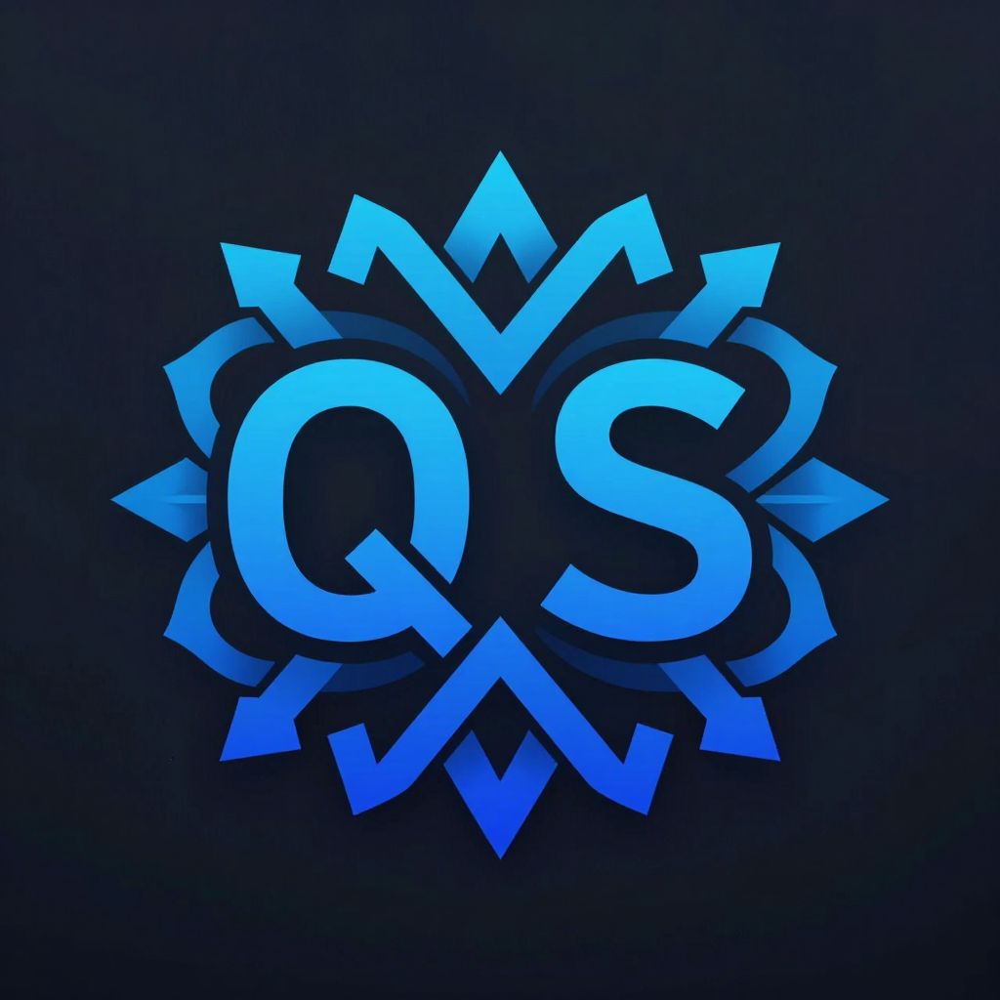
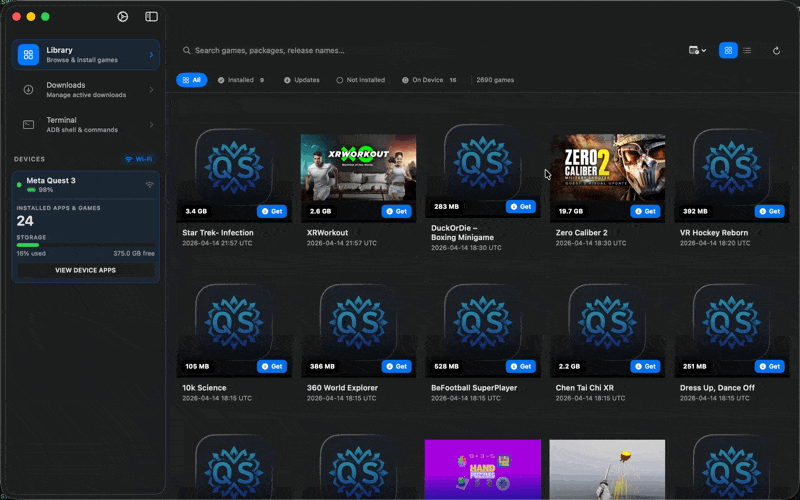

<div align="center">



# QuestSyndicate

**A native macOS app for managing Meta Quest VR devices.**  
Download, sideload, and manage your entire VR game library — all in one place.




</div>

---

## ✨ Features

### 🎮 Game Library
- Browse thousands of VR games synced from the **VrSrc server**
- **Grid & List view** modes with cover art thumbnails
- Real-time **search, sort, and filter** (Installed, Updates Available, etc.)
- One-click **download → extract → install** pipeline
- Automatic install after download + optional auto-cleanup of archives
- Game detail sheets with version info, release notes, and install status

### 📱 Device Management
- **USB and Wi-Fi ADB** device support — connect any way you prefer
- Live device card showing battery level, storage usage, and model info
- **Enable Wi-Fi ADB** from USB in one click — seamless USB→Wi-Fi handoff
- Save **Wi-Fi bookmarks** for instant reconnection without a cable
- Auto-detects and displays all connected Quest devices (Quest 2, 3, 3S, Pro, and more)
- Shows installed package count per device

### ⬇️ Download Manager
- Parallel download queue powered by **rclone** (up to 3 concurrent)
- Real-time progress tracking with speed, ETA, and per-file status
- Pause, resume, and cancel individual downloads
- Configurable **download speed limits** and custom download folder

### 📦 Install & Sideload
- **Drag-and-drop** APK or extracted game folder directly onto the app window
- Automatic OBB data installation alongside APKs
- Manual "Install APK" button for single-file installs
- Smart package name detection from folder structures

### 📤 Upload / Export
- Export installed games (APK + OBB) from your Quest to your Mac
- Upload local APK files directly to your device

### 🖥️ ADB Terminal
- Integrated **ADB shell terminal** for advanced device commands
- Full interactive shell, command history, and output display

### 🔗 Mirror Support
- Configure custom rclone mirrors / remotes for VrSrc game downloads
- Active mirror management with config import/export

### ⚙️ Settings
| Tab | Description |
|-----|-------------|
| **General** | Download folder, color scheme, auto-install & auto-delete toggles, thumbnail cache management |
| **Server** | VrSrc server URL & password, raw JSON config editor, manual game library sync |
| **Blacklist** | Hide games by package name — custom entries + server blacklist |
| **Tools** | View status of bundled ADB, rclone & 7-Zip; re-download any tool |
| **About** | Version info, links to GitHub, ADB Docs, and SideQuest |

---

## 🛠️ How It Works

QuestSyndicate bundles three open-source CLI tools that are **automatically downloaded on first launch** — no Homebrew or manual setup required:

| Tool | Purpose |
|------|---------|
| [ADB](https://developer.android.com/studio/command-line/adb) | Communicates with your Quest over USB or Wi-Fi |
| [rclone](https://rclone.org) | Downloads game archives from the VrSrc server |
| [7-Zip (7zz)](https://www.7-zip.org) | Extracts encrypted `.7z` game archives |

All binaries are stored in `~/Library/Application Support/QuestSyndicate/bin/` and are **not system-wide installs**.

---

## 🚀 Getting Started

### Requirements
- **macOS 26 Tahoe** or later (required — the app uses Liquid Glass and other macOS 26-only APIs)
- A **Meta Quest** device (Quest 2, Quest 3, Quest 3S, Quest Pro, or Quest experimental models)
- A VrSrc server URL and password (from the VrSrc community)

### Installation
1. Download the latest `.dmg` from the [Releases](https://github.com/Ichigo3766/QuestSyndicate/releases) page
2. Open the `.dmg` and drag **QuestSyndicate** to your Applications folder
3. Launch the app — it will automatically download ADB, rclone, and 7-Zip on first run

### First-Time Setup
1. Launch the app — the VrSrc server is **pre-configured by default**, so no setup is needed to get started
2. The game library will automatically sync on first launch
3. Connect your Quest via USB (enable developer mode on the headset first)
4. Select your device in the sidebar and start downloading games!

> **Note:** You only need to visit **Settings → Server** if you want to use a custom server URL, change the password, or switch to a different mirror.

### Enable Wi-Fi ADB
1. Connect your Quest via USB
2. Click the device card in the sidebar → **Enable Wi-Fi**
3. Once enabled, you can unplug USB — the app will seamlessly switch to wireless
4. Your device is saved as a Wi-Fi bookmark for future reconnections

---

## 🏗️ Architecture

QuestSyndicate is built with **SwiftUI** and **Swift Observation** (`@Observable`), targeting macOS exclusively.

```
QuestSyndicate/
├── App/
│   ├── QuestSyndicateApp.swift   # App entry point, window setup
│   ├── AppState.swift            # Central @Observable app state
│   └── AppCommands.swift         # macOS menu bar commands
├── Models/
│   ├── GameInfo.swift            # VR game model
│   ├── DeviceInfo.swift          # ADB device model
│   ├── DownloadItem.swift        # Download queue item
│   ├── Mirror.swift              # rclone mirror config
│   └── ...
├── Services/
│   ├── ADBService.swift          # ADB process management & device tracking
│   ├── RcloneService.swift       # rclone download orchestration
│   ├── GameLibraryService.swift  # VrSrc game list sync & caching
│   ├── DownloadPipeline.swift    # Download → Extract → Install pipeline
│   ├── InstallationService.swift # APK + OBB installation via ADB
│   ├── ExtractionService.swift   # 7-Zip archive extraction
│   ├── DependencyManager.swift   # Auto-download of ADB/rclone/7zz binaries
│   ├── MirrorService.swift       # rclone mirror management
│   ├── ThumbnailCacheService.swift # Async cover art cache
│   └── UploadService.swift       # APK upload to device
├── Views/
│   ├── Sidebar/                  # Navigation sidebar + device cards
│   ├── Library/                  # Game grid/list, search, filters, detail sheet
│   ├── Downloads/                # Active download queue UI
│   ├── Uploads/                  # Upload queue UI
│   ├── Terminal/                 # Interactive ADB shell
│   ├── Mirrors/                  # Mirror management
│   └── Settings/                 # Full settings UI (General/Server/Blacklist/Tools/About)
└── Utilities/
    ├── Constants.swift           # Paths, URLs, and global constants
    ├── Extensions.swift          # SwiftUI view modifiers (glass card, shimmer, etc.)
    └── ...
```

### Key Design Decisions
- **`@Observable`** macro (Swift 5.9+) for fine-grained UI reactivity without `@Published` boilerplate
- **Actor-isolated services** (`ADBService`, `RcloneService`, etc.) for safe concurrent CLI process management
- **Structured Concurrency** (`async/await`, `TaskGroup`) throughout — no DispatchQueue or callbacks
- **In-memory caches** for Wi-Fi bookmarks and installed status to avoid per-frame disk I/O
- All CLI tools run as **child processes** via `ProcessRunner` — the app itself requires no special entitlements beyond file access

---

## 📸 Screenshots

> *Connect your Quest, browse the VrSrc library, and install games — all without leaving the app.*

The main window features a **three-column layout**:
- **Left sidebar** — navigation tabs (Library, Downloads, Terminal) + connected device cards
- **Main area** — context-sensitive content (game grid, download list, or ADB shell)

---

## 🤝 Contributing

Pull requests are welcome! For major changes, please open an issue first to discuss what you'd like to change.

1. Fork the repo
2. Create your feature branch (`git checkout -b feature/amazing-feature`)
3. Commit your changes (`git commit -m 'Add amazing feature'`)
4. Push to the branch (`git push origin feature/amazing-feature`)
5. Open a Pull Request

---

## ⚠️ Disclaimer

QuestSyndicate is an **unofficial tool**. It is not affiliated with or endorsed by Meta Platforms, Inc. Use it responsibly and only with content you are legally permitted to install on your device.

---

## 📄 License

This project is licensed under the **MIT License** — see the [LICENSE](LICENSE) file for details.
